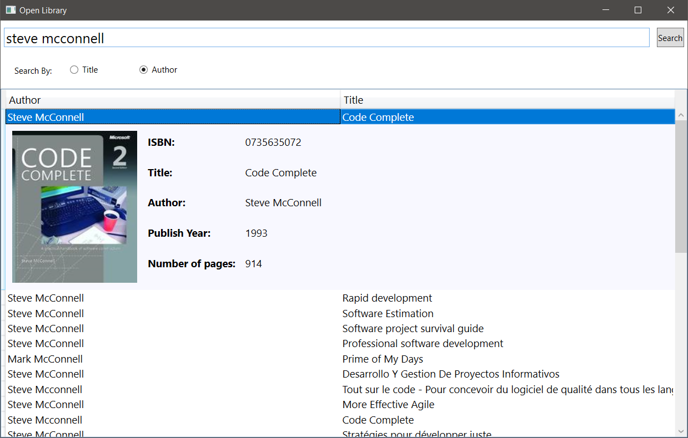
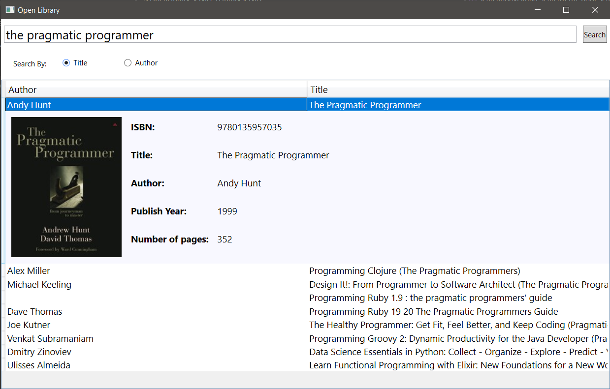
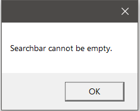
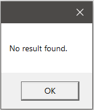

# Open Library
This app fetches information from the openlibrary.org API and presents it in a Windows desktop application.

# Technologies
- .NET Core 
- WPF UI
- MVVM Pattern
- HttpClient is used for backend communication with API
- NLog is used for logging application errors
- XUnit for testing

## Features 
- Search library by book or by author 
- List of general information (author - book title)
- Detailed information for each book

## Screenshots

 
